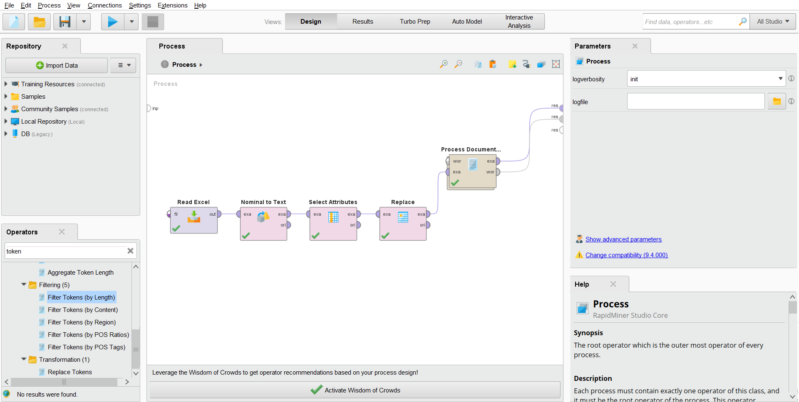
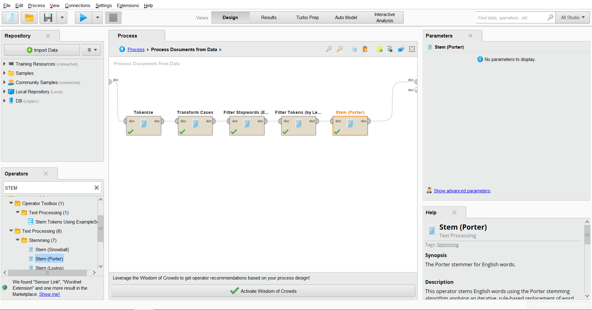
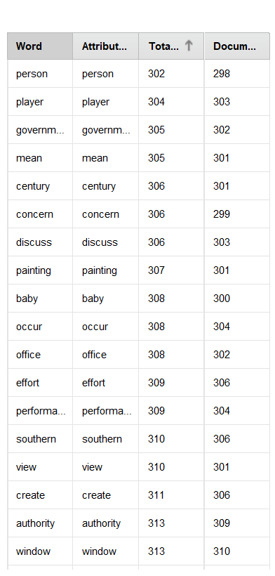

# EX9 Preprocessing on Twitter Data using Rapidminer
### Name       : Swathika G
### Reg Number : 212221230113
### Date       : 13.04.2024 
## AIM: 
To implement preprocessing technique on Twitter Data using Rapidminer
## Description: 

RapidMiner provides data mining and machine learning procedures including: data loading and transformation (ETL), data preprocessing and visualization, 
predictive analytics and statistical modeling, evaluation, and deployment. RapidMiner is written in the Java programming language. 
RapidMiner provides a GUI to design and execute analytical workflows. Those workflows are called “Processes” in RapidMiner and they consist of multiple “Operators”. 
Each operator performs a single task within the process, and the output of each operator forms the input of the next one. Alternatively, the engine can be called from 
other programs or used as an API. Individual functions can be called from the command line. 
RapidMiner provides learning schemes, models and algorithms and can be extended using R and Python scripts.

## Procedure:
1) ***Import Twitter data:*** Import the Twitter data into RapidMiner. You can do this by selecting the appropriate
data source operator, such as "Read Excel" or "Read CSV," and specifying the location of your Twitter data
file.
2) ***Preprocess data:*** Preprocess the imported data to clean and prepare it for text processing. Use the following
operators for preprocessing:
    
a. Tokenize: Split the text into individual words or tokens.
    
b. Transform Cases: Convert the text to lowercase or uppercase to ensure consistency.
    
c. Remove Stopwords: Remove common words that do not provide much meaningful information.
    
d. Remove Special Characters: Eliminate special characters, such as punctuation marks or symbols.
    
e. Remove Numbers: Exclude numeric values from the text.
3) ***Stemming:*** Apply stemming to reduce words to their root forms. You can use operators like "Stem (Porter)"
for this purpose.

### Output:

### Result:
Thus, the preprocessing technique on Twitter Data using Rapidminer is implemented successfully.
